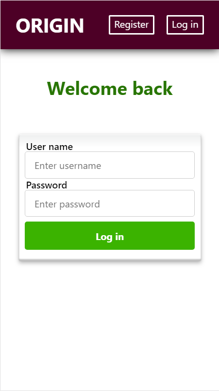
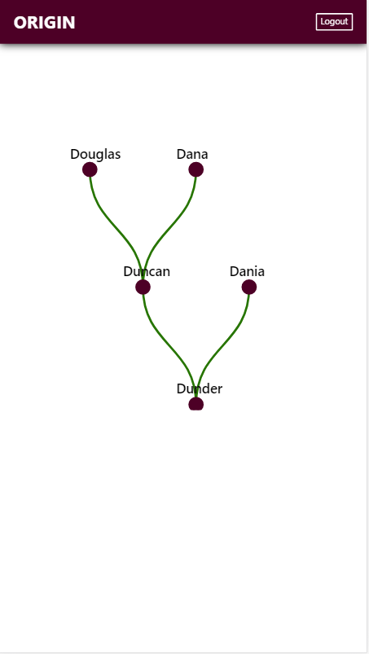

# Origin
- Live version: https://origin-app.now.sh (access app with username: joe, password: Joe2joe!)
- Required Origin API:
  - Live: https://murmuring-reef-29838.herokuapp.com
  - Repository: https://github.com/yulia-kh/origin-api

## Description
Origin is a family tree software that makes it easy to organize and visualize your family relationships. Create an account and start adding your ancestors. Enjoy the view!

## Getting Started
- Clone the repository and run `npm i`
- To run: `npm start`
- To test: `npm test`

## Screenshots
### Landing page

### Log in

### Home

## Tech stack
- ReactJS
- HTML5
- CSS3